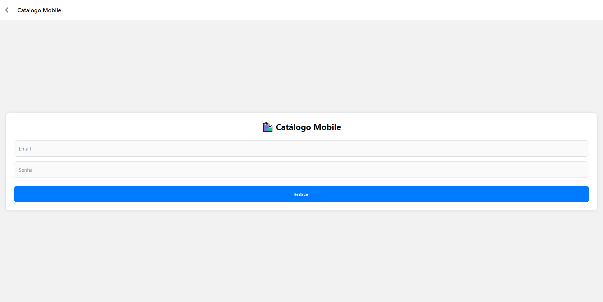
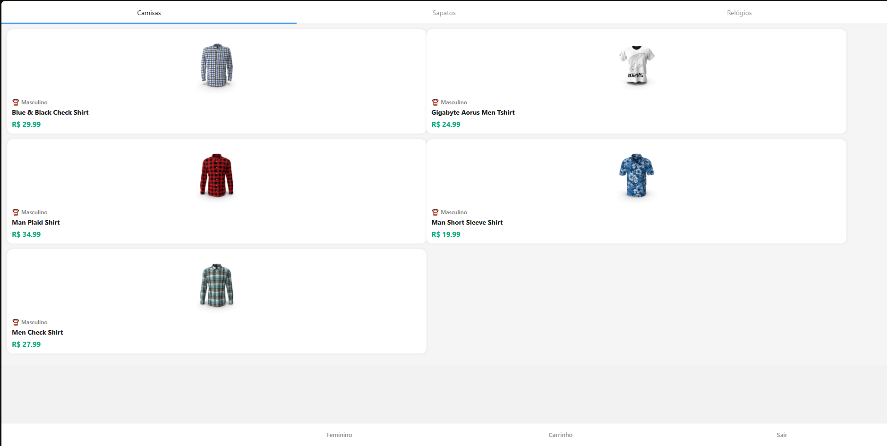
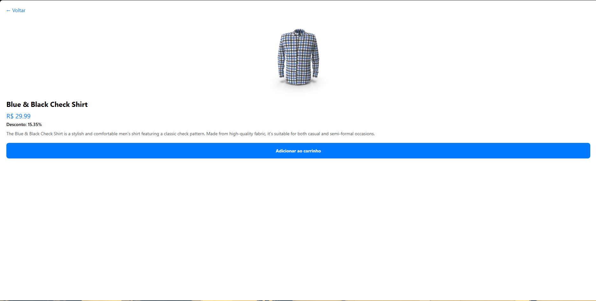
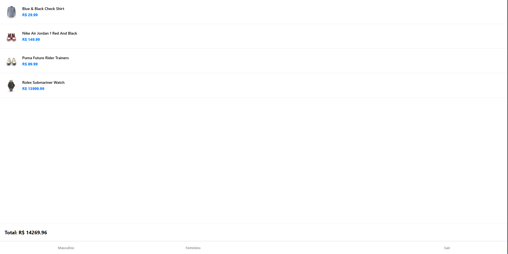

# 🛍️ Mobile E-Commerce App (React Native) #

Aplicativo mobile de e-commerce desenvolvido com React Native (Expo) que consome uma API REST de produtos, permitindo visualizar itens, ver detalhes e adicioná-los ao carrinho.

O projeto foi desenvolvido com foco em praticar conceitos de desenvolvimento mobile, consumo de APIs e gerenciamento de estado com Redux Toolkit.

---

# 📱 Funcionalidades #

O aplicativo possui as seguintes telas e funcionalidades:

### 🔐 Tela de Login ###

* Validação básica de dados
* Armazenamento temporário das informações do usuário
* Redirecionamento para a área principal do aplicativo após login

### 🛒 Listagem de Produtos ###

* Produtos exibidos em abas:

  * Masculino
  * Feminino
* Consumo de dados através de API REST
* Navegação para tela de detalhes

### 📦 Detalhes do Produto ###

* Exibe:

  * Nome
  * Imagem
  * Descrição
  * Preço
  * Percentual de desconto
* Botão para adicionar produto ao carrinho

### 🛍️ Carrinho ###

* Lista de produtos adicionados
* Exibição do valor total da compra
* Gerenciamento de estado com Redux Toolkit

### 🚪 Logout ###

* Limpeza dos dados armazenados
* Limpeza do carrinho
* Redirecionamento para tela de login

---

# ⚙️ Tecnologias Utilizadas #

As principais tecnologias utilizadas no projeto são:

* React Native
* Expo
* Expo Router
* Axios
* Redux Toolkit
* React Redux
* AsyncStorage

---

# 📂 Estrutura do Projeto #

```bash
src/
 ├── components
 ├── context
 │    ├── CartContext.js
 │
 ├── screens
 │    ├── CartScreen.js
 │    ├── LoginScreen.js
 │    ├── ProductDetailScreen.js
 │    ├── ProductListScreen.js
 │
 ├── services
 │    └── api.js
 │
 ├── store
 │    ├── store.js
 │    └── cartSlice.js
 │
 └
```

Estrutura principal do Expo:

```
app/
 ├── (tabs)
 ├── product
 ├── _layout.tsx
 └── index.ysx
 └──modal.tsx
 └──products.tsx
```

---

# 🌐 API Utilizada #

O aplicativo consome dados da seguinte API pública:

https://dummyjson.com/products

A API fornece informações como:

* título do produto
* preço
* imagem
* descrição
* desconto

---

# 🚀 Como Executar o Projeto

### 1️⃣ Clonar o repositório ###

```bash
git clone URL_DO_REPOSITORIO
```

### 2️⃣ Instalar dependências ###

```bash
npm install
```

ou

```bash
yarn install
```

### 3️⃣ Executar o projeto ###

```bash
npx expo start
```

### 4️⃣ Rodar no celular ###

Instale o aplicativo:

Expo Go

Depois:

* escaneie o QR Code gerado no terminal

---

# 📸 Prints do Aplicativo

* Tela de Login



* Tela de Produtos



* Tela de Detalhes



* Tela do Carrinho




---

# 🎯 Objetivo do Projeto #

Este projeto tem como objetivo aplicar na prática conceitos aprendidos em aula, incluindo:

* Desenvolvimento de aplicativos móveis
* Consumo de APIs REST
* Gerenciamento de estado com Redux
* Navegação entre telas
* Estruturação de projetos React Native

---

# 👨‍💻 Autor #

Nome: Lucas Ribeiro Soares
RA: 105437
Link YouTube: https://youtu.be/S5W6aM84xV8
Link GitHub: https://github.com/lucaasoares/catalogo-mobile-react-native
Curso: Analise e Desenvolvimento de Sistemas
Estudante de Tecnologia / Desenvolvimento de Software
